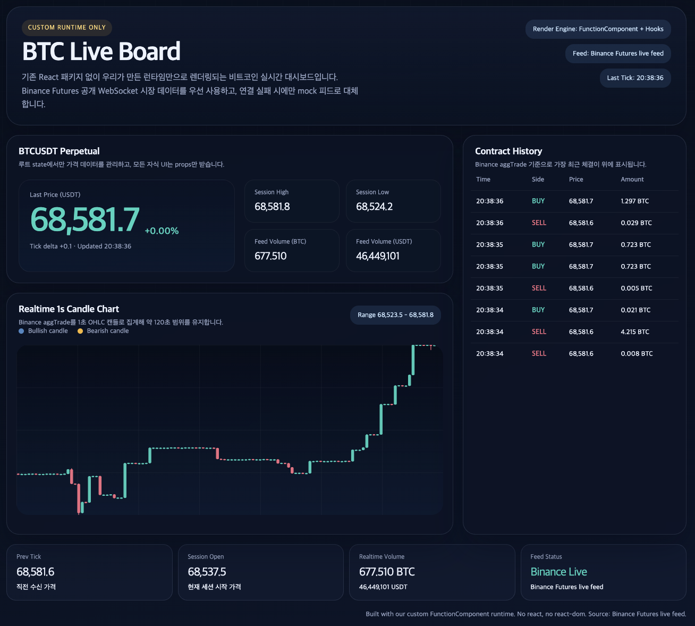
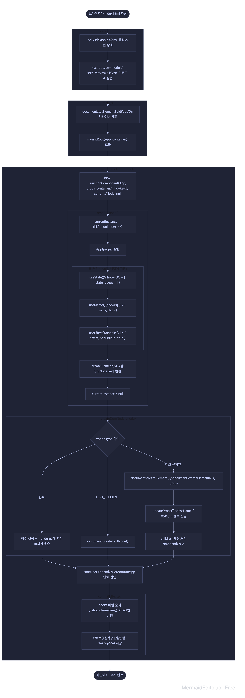
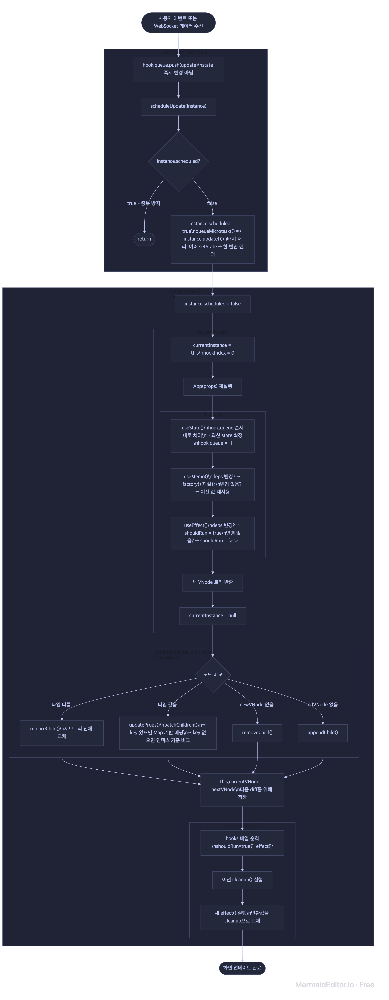
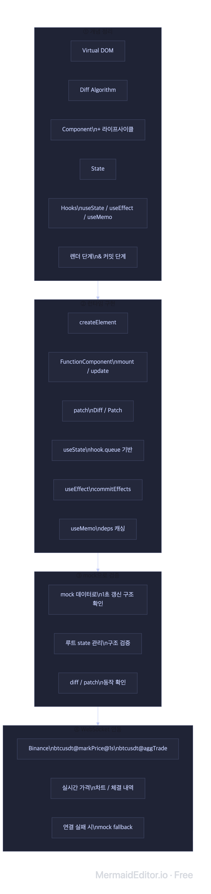

# week5-team6-react2

React의 핵심 개념을 참고하되, 기존 `react`, `react-dom` 패키지를 사용하지 않고 우리가 직접 만든 모듈만으로 화면을 렌더링하는 프로젝트입니다.  
현재 결과물은 **커스텀 런타임 기반 비트코인 실시간 대시보드**이며, Vercel 같은 정적 호스팅 환경에서 열었을 때 가격, 그래프, 계약 히스토리가 갱신되는 화면을 목표로 합니다.

## 1. 코인 실시간 시세를 주제로 데모 웹을 만든 이유

- 데이터가 1초마다 바뀌어 **State 변경 → 리렌더 흐름**을 반복적으로 확인하기에 적합하다
- 가격·차트·체결 내역이 동시에 갱신되어 **Diff/Patch로 필요한 DOM만 업데이트**하는 의미가 명확하게 드러난다
- 모든 state를 루트(App)에서 관리하고, 자식 컴포넌트는 props만 받아 렌더링만 담당한다
  — 데이터 흐름이 위에서 아래로 단방향으로 흐르기 때문에 어디서 상태가 바뀌는지 추적하기 쉽다

## 2. 동작하는 방식

### 2-1. 최초 렌더 흐름

### 2-2. 상태 변경 후 업데이트 흐름

### 2-3. 우리 팀 구현 특징

상태 변경 후 업데이트 흐름은 모든 팀이 비슷해 보일 수 있지만, 실제 구현 방식은 꽤 달라질 수 있습니다.  
이 프로젝트에서 우리 팀이 선택한 방식은 아래와 같습니다.

> **상태가 자주 바뀌는 실시간 화면일수록, DOM 직접 조작보다 state 중심으로 UI를 일관되게 관리할 수 있다는 점이 가장 큰 장점입니다.**

- `setState`는 값을 바로 바꾸지 않고 hook 내부 `queue`에 먼저 저장합니다.
  다음 렌더에서 queue를 순서대로 처리해 최종 state를 확정합니다.
- 상태 변경 직후 즉시 렌더하지 않고, `scheduleUpdate`로 다음 마이크로태스크에 렌더를 한 번만 예약합니다.
  그래서 짧은 시간 안에 여러 상태 변경이 들어와도 한 번의 업데이트 흐름으로 묶을 수 있습니다.
- hooks는 컴포넌트 인스턴스 내부의 `hooks` 배열과 `hookIndex`로 관리합니다.
  즉 `useState`, `useEffect`, `useMemo` 모두 “호출 순서”를 기준으로 같은 배열 안에서 추적합니다.
- 차트는 외부 차트 라이브러리를 사용하지 않고, `svg`, `line`, `rect`, `polyline`, `text` 같은 SVG DOM 요소를 직접 Virtual DOM으로 생성해 렌더링합니다.
  런타임은 SVG 태그를 `createElementNS(...)`로 실제 SVG DOM에 붙여 실시간 차트를 구성합니다.
- 차트가 갱신될 때는 최신 candle 배열 전체를 기준으로 `buildChartMeta()`가 x, y, range, 이동평균선 좌표를 다시 계산합니다.
  그 다음 런타임이 이전 Virtual DOM과 새 Virtual DOM을 비교해, 실제 SVG DOM에서는 바뀐 속성과 노드만 patch합니다.
- `useEffect`는 DOM patch 이후 실행합니다.
  즉 화면이 먼저 반영된 뒤, WebSocket 연결이나 cleanup 같은 부수효과를 처리합니다.
- `useMemo`는 deps가 바뀔 때만 다시 계산합니다.
  현재 프로젝트에서는 차트를 그리기 위한 range, 좌표, 이동평균선 같은 파생 데이터를 계산할 때 사용합니다.

`useMemo`와 `ChartPanel`의 역할을 아주 쉽게 나누면,  
`useMemo`는 **차트를 그리기 위한 좌표 설명서(chartMeta)를 만드는 계산 담당**이고, `ChartPanel`은 **그 설명서를 보고 실제 SVG를 그리는 렌더 담당**입니다.

- `useMemo`는 `buildChartMeta()`를 통해 candle 데이터로부터 x 위치, y 위치, 축 눈금 위치, 이동평균선 점 위치를 계산합니다.
- 이렇게 만들어진 `chartMeta`는 루트 `App`에서 한 번 만들어져 props로 내려갑니다.
- `ChartPanel`은 `chartMeta.candles`를 보고 `line`, `rect`로 캔들을 그리고, `chartMeta.axisTicks`를 보고 오른쪽 세로축과 가로 보조선을 그리고, `chartMeta.movingAverage`를 보고 `polyline`으로 이동평균선을 그립니다.
- 즉 원본 candle 데이터는 바로 화면에 그려지지 않고, 먼저 “어디에 그릴지 계산된 값”으로 바뀐 뒤 SVG 요소로 렌더링됩니다.

정리하면, 우리 팀 구현의 핵심은  
**queue 기반 state 처리 → 마이크로태스크 단위 렌더 예약 → hook 기반 실행 관리 → effect 후처리**  
흐름으로 볼 수 있습니다.

## 3. 프로젝트 진행 방식

  

### 3-1. docs 기술 정리

먼저 React 핵심 기능을 문서로 나눠 정리했습니다.

- [docs/01-virtual-dom.md](./docs/01-virtual-dom.md)
- [docs/02-diff-algorithm.md](./docs/02-diff-algorithm.md)
- [docs/03-component.md](./docs/03-component.md)
- [docs/04-state.md](./docs/04-state.md)
- [docs/05-hooks.md](./docs/05-hooks.md)
- [docs/06-render-commit-phase.md](./docs/06-render-commit-phase.md)

그리고 현재 코드 기준 실행 순서를 따로 정리했습니다.

- [docs/execution-order-guide.md](./docs/execution-order-guide.md)

### 3-2. 프롬프트 정리

설계 의도를 유지하면서 구현을 요청할 수 있도록 프롬프트 문서도 따로 정리했습니다.

- [docs/implementation-prompt.md](./docs/implementation-prompt.md)
- [docs/core-implementation-prompt.md](./docs/core-implementation-prompt.md)
- [docs/bitcoin-ui-prompt.md](./docs/bitcoin-ui-prompt.md)
- [docs/realtime-data-connection-prompt.md](./docs/realtime-data-connection-prompt.md)
- [docs/run-implementation-prompt.md](./docs/run-implementation-prompt.md)

### 3-3. mock 데이터로 먼저 개발

처음부터 실제 거래소 데이터를 붙이지 않고, 먼저 mock 데이터로 아래 흐름을 검증했습니다.

- 루트 state 관리 구조
- hook queue 기반 상태 갱신
- Virtual DOM 생성
- diff / patch
- 1초 단위 차트와 체결 히스토리 렌더링

이 단계의 목적은 네트워크 이슈 없이도 **우리 런타임 자체가 정상 동작하는지** 먼저 확인하는 것이었습니다.

### 3-4. 실제 WebSocket 연동

그 다음 mock 기반 구조를 유지한 상태에서 Binance Futures 공개 WebSocket을 연동했습니다.

- `btcusdt@markPrice@1s`
- `btcusdt@aggTrade`

실시간 가격, 1초 캔들 차트, 계약 체결 히스토리를 실제 시장 데이터로 갱신하도록 확장했습니다.
또한 연결 실패 시 mock 데이터로 fallback 하도록 해서, 학습용 데모가 네트워크 문제로 완전히 죽지 않게 구성했습니다.

## 4. 회고

각 개념은 따로 이해할 수 있어도, 실제 코드에서 전체 흐름을 파악하는 것이 가장 어려웠다.
특히 LLM이 작성한 코드를 보면서 흐름을 추적하는 것은 더욱 어려웠다. 코드 자체는 동작하지만 왜 이렇게 연결되어 있는지 맥락을 잡기까지 시간이 많이 걸렸다.
