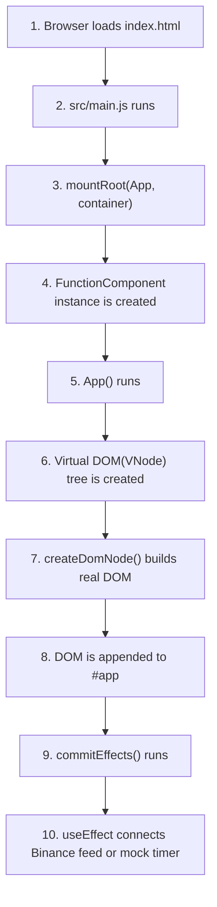
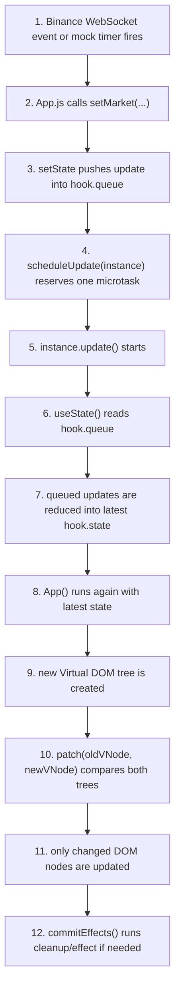

# week5-team6-react2

React의 핵심 개념을 참고하되, 기존 `react`, `react-dom` 패키지를 사용하지 않고 우리가 직접 만든 모듈만으로 화면을 렌더링하는 프로젝트입니다.  
현재 결과물은 **커스텀 런타임 기반 비트코인 실시간 대시보드**이며, Vercel 같은 정적 호스팅 환경에서 열었을 때 가격, 그래프, 계약 히스토리가 갱신되는 화면을 목표로 합니다.

## 프로젝트 목표

- Component, State, Hooks를 직접 구현
- Virtual DOM + Diff + Patch를 직접 구현
- 최종적으로 비트코인 실시간 데이터를 1초 단위로 보여주는 화면 구현
- 기존 React 런타임 없이 우리가 만든 패키지/라이브러리만으로 동작

세부 설계 문서는 [docs/README.md](./docs/README.md) 와 [docs/requirements.md](./docs/requirements.md) 에 정리되어 있습니다.

## 가장 중요한 제약

- `react`, `react-dom`을 사용하지 않습니다.
- 화면은 반드시 우리가 직접 구현한 런타임 위에서 동작해야 합니다.
- 상태는 루트 컴포넌트에서만 관리합니다.
- 자식 컴포넌트는 props만 받는 stateless 순수 함수 형태를 유지합니다.

## Diagram

README에서 바로 전체 흐름을 볼 수 있도록 현재 구현 기준 도식을 정리했습니다.  
더 자세한 설명은 [docs/execution-order-guide.md](./docs/execution-order-guide.md) 와 [docs/06-render-commit-phase.md](./docs/06-render-commit-phase.md) 에 있습니다.

### 앱 시작 흐름



### 상태 변경과 Virtual DOM 반영 흐름



### 데이터 흐름

```mermaid
flowchart LR
    A["Binance Futures public streams"] --> B["src/app/binance-feed.js"]
    B --> C["onEvent(payload)"]
    C --> D["src/app/App.js"]
    D --> E["setMarket(previousState => nextState)"]
    E --> F["src/app/market-data.js"]
    F --> G["next market state"]
    G --> H["src/lib/runtime.js"]
    H --> I["Virtual DOM diff / patch"]
    I --> J["Price panel, chart, contract history UI"]
```



## 현재 구현된 내부 로직

### 1. 커스텀 Virtual DOM 런타임

[src/lib/runtime.js](./src/lib/runtime.js) 에서 아래 기능을 직접 구현했습니다.

- `createElement`
  JSX 없이 VNode를 만드는 함수입니다.
- `FunctionComponent`
  함수형 컴포넌트를 감싸는 루트 렌더 단위입니다.
- `patch`
  이전 VNode와 새 VNode를 비교해 필요한 DOM만 갱신합니다.
- `useState`
  `hooks` 배열과 `hookIndex` 기반으로 상태를 유지합니다.
- `useEffect`
  렌더 후 effect를 실행하고 cleanup을 관리합니다.
- `useMemo`
  deps가 바뀔 때만 계산값을 갱신합니다.

런타임 흐름은 아래와 같습니다.

1. 루트 `FunctionComponent`가 컴포넌트 함수를 실행합니다.
2. 컴포넌트 함수는 VNode 트리를 반환합니다.
3. 최초 렌더에서는 실제 DOM을 생성합니다.
4. 상태가 바뀌면 같은 컴포넌트를 다시 실행합니다.
5. `patch`가 이전 트리와 새 트리를 비교해 바뀐 DOM만 갱신합니다.
6. 렌더가 끝난 뒤 `useEffect` effect를 실행합니다.

### 2. 루트 상태 기반 비트코인 대시보드

[src/app/App.js](./src/app/App.js) 는 모든 상태를 루트에서 관리하고, 자식 UI 컴포넌트는 props만 받아 렌더링합니다.

구성 요소:

- `Header`
- `PricePanel`
- `ChartPanel`
- `TradesPanel`
- `TickerStrip`

이 구조는 문서에서 정의한 `Lifting State Up` 제약을 그대로 따릅니다.

### 3. 데이터 계층

[src/app/market-data.js](./src/app/market-data.js) 는 대시보드에서 쓰는 데이터 가공 로직을 담당합니다.

- 초기 시장 상태 생성
- mock 가격 시계열 생성
- mock 체결 히스토리 생성
- live 가격 이벤트 반영
- live 체결 이벤트 반영
- 차트용 좌표 계산
- 가격/수량/시간 포맷팅

즉, UI는 데이터를 직접 계산하지 않고 가공된 상태만 받아 렌더링합니다.

### 4. Binance WebSocket 연동

[src/app/binance-feed.js](./src/app/binance-feed.js) 에서 Binance USDⓈ-M Futures 공개 market stream을 연결합니다.

현재 사용하는 스트림:

- `btcusdt@markPrice@1s`
- `btcusdt@aggTrade`

동작 방식:

1. 앱 시작 시 Binance WebSocket 연결 시도
2. `markPrice@1s` 이벤트로 가격과 그래프 시계열 갱신
3. `aggTrade` 이벤트로 계약 히스토리와 볼륨 갱신
4. 연결 실패 또는 데이터 무응답 시 mock 피드로 자동 fallback

이렇게 해서 네트워크 제약이 있어도 화면이 완전히 죽지 않도록 구성했습니다.

## 현재 도출된 결과물

지금 브랜치에서 실행하면 아래 기능을 가진 페이지가 만들어집니다.

- 커스텀 런타임으로 렌더링되는 비트코인 대시보드
- 실시간 가격 표시
- 실시간 가격 그래프
- 실시간 계약 체결 히스토리
- feed 상태 표시
  Binance live 또는 mock fallback 여부를 UI에서 확인 가능
- 실제 WebSocket 연결 실패 시 mock 데이터로 계속 동작

즉, 결과물은 단순한 정적 화면이 아니라:

- 우리가 직접 구현한 렌더링 엔진
- 직접 구현한 상태 관리
- 직접 구현한 effect 처리
- 실제 시장 데이터 또는 fallback mock 데이터

를 합쳐 만든 실행 가능한 데모입니다.

## 파일 구조

```text
.
├── docs/
│   ├── requirements.md
│   ├── 01-virtual-dom.md ~ 06-render-commit-phase.md
│   └── 각종 구현 프롬프트 문서
├── scripts/
│   ├── start.mjs
│   └── verify.mjs
├── src/
│   ├── app/
│   │   ├── App.js
│   │   ├── binance-feed.js
│   │   └── market-data.js
│   ├── lib/
│   │   └── runtime.js
│   └── main.js
├── index.html
├── styles.css
└── package.json
```

## 실행 방법

```bash
npm run start
```

기본 실행 주소:

```text
http://localhost:4173
```

## 검증 방법

```bash
npm run verify
```

이 검증 스크립트는 최소한 아래 항목을 확인합니다.

- 런타임 주요 API 존재 여부
- 초기 시장 상태 생성 여부
- mock 상태 전이 동작 여부
- 차트 메타데이터 생성 여부
- 기본 포맷 함수 동작 여부

## 문서 참고

- 전체 문서 인덱스: [docs/README.md](./docs/README.md)
- 요구사항 정의: [docs/requirements.md](./docs/requirements.md)
- 실행용 프롬프트: [docs/run-implementation-prompt.md](./docs/run-implementation-prompt.md)

## 현재 한계와 다음 단계

- 현재 차트는 lightweight SVG 그래프입니다.
- 현재는 호가창(order book)을 구현하지 않았습니다.
- Binance 연결은 공개 market stream 기준이며, 실패 시 mock으로 대체됩니다.
- 다음 단계에서는 실제 order book 동기화, Vercel 배포 최적화, 런타임 기능 확장을 진행할 수 있습니다.
