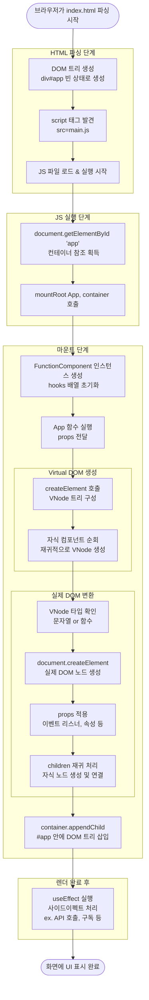
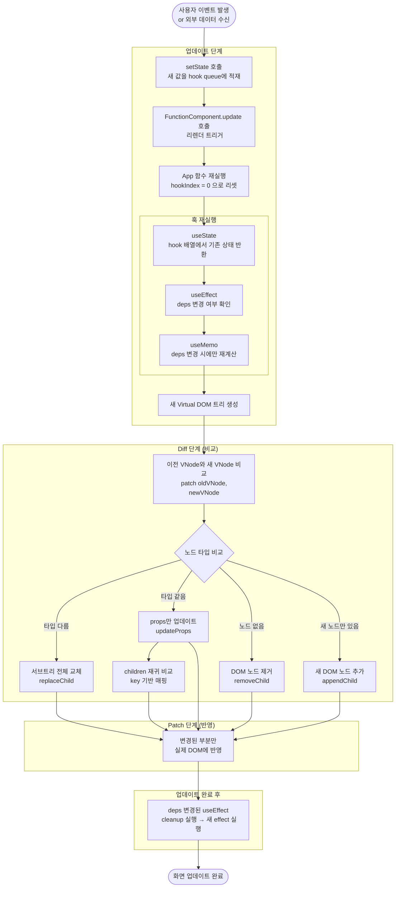

# 실행 흐름 (Execution Flow)

## 전체 흐름 개요



---

## 상태 변경 시 업데이트 흐름



---

## 핵심 개념 정리

### 최초 렌더 vs 업데이트 렌더

| | 최초 렌더 (mount) | 업데이트 렌더 (update) |
|---|---|---|
| 트리거 | `mountRoot()` 호출 | `setState()` 호출 |
| hooks | 초기값으로 초기화 | 기존 상태 유지 |
| DOM | 새로 생성 후 삽입 | diff 후 변경분만 반영 |
| alternate | `null` | 이전 Fiber 참조 |
| useEffect | 모든 effect 실행 | deps 변경된 effect만 실행 |

### Virtual DOM이 실제 DOM으로 변환되는 과정

```
VNode { type: 'div', props: { className: 'box', children: [...] } }
  │
  ├── document.createElement('div')
  ├── dom.className = 'box'
  └── children 순회 → 재귀적으로 동일 과정 반복
        └── 완성된 자식 노드를 부모에 appendChild
```

### key 기반 리스트 업데이트

```
이전 children    새 children
key='a' ──────── key='a'   (재사용, props만 비교)
key='b'    ╲  ╱  key='c'   (신규 생성)
key='c' ────╳    key='b'   (재사용, 위치만 이동)
            ╱
           (key='b' 매칭)
```
