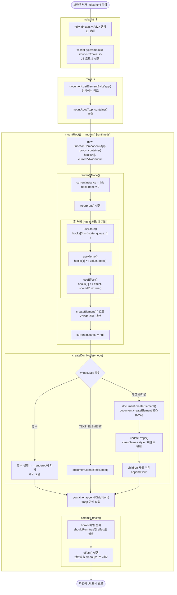
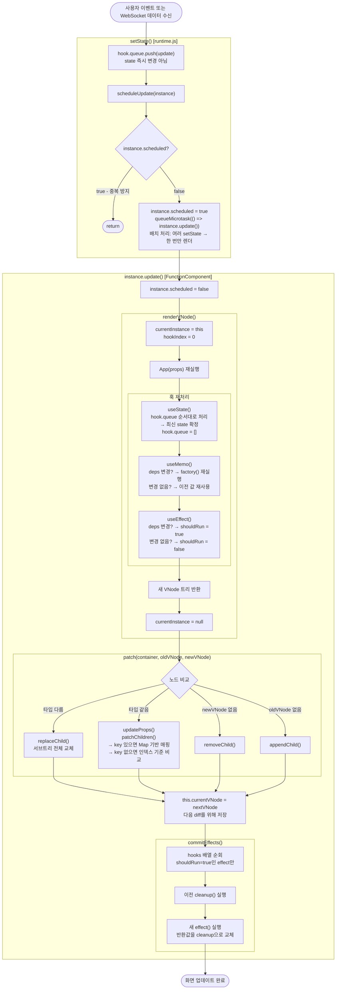

# 실행 흐름 (Execution Flow)

## 최초 렌더 흐름 (텍스트 정리)

```
브라우저가 index.html 파싱
  → <div id="app"></div> 빈 상태로 DOM에 생성
  → <script type="module" src="./src/main.js"> 태그 만남 → JS 로드 & 실행

main.js 실행
  → document.getElementById('app') 으로 컨테이너 참조 획득
  → mountRoot(App, container) 호출

mountRoot() [runtime.js]
  → new FunctionComponent(App, props, container) 인스턴스 생성
      - hooks[]    : 빈 배열 (useState/useEffect/useMemo 저장소)
      - currentVNode: null (직전 렌더 결과)
      - scheduled  : false (리렌더 예약 여부)
  → instance.mount() 호출

mount() [FunctionComponent]
  → renderVNode() 호출
      - currentInstance = this  (훅이 어떤 인스턴스에 저장될지 지정)
      - hookIndex = 0           (훅 호출 순서 초기화)
      - App(props) 실행         (함수형 컴포넌트 실행)
          → useState 호출 → hooks[0]에 초기 state 저장
          → useMemo 호출  → hooks[1]에 계산 결과 저장
          → useEffect 호출 → hooks[2]에 effect 예약 (아직 실행 안 됨)
          → createElement(h) 호출들 → VNode 트리 반환
      - currentInstance = null  (렌더 종료)
  → createDomNode(vnode) 로 VNode → 실제 DOM 변환
      - type이 함수이면 함수 호출 → 재귀
      - type이 TEXT_ELEMENT이면 createTextNode
      - type이 문자열(태그명)이면 createElement / createElementNS(SVG)
      - updateProps로 className, style, 이벤트 등 반영
      - children 재귀 처리 → appendChild
  → container.innerHTML = ""  (기존 내용 비움)
  → container.appendChild(dom) → #app 안에 삽입
  → commitEffects() 실행
      - hooks 배열 순회
      - shouldRun이 true인 effect hook만 실행
      - effect() 반환값이 함수이면 cleanup으로 저장

화면에 UI 표시됨
```

---

## 상태 변경 후 업데이트 흐름 (텍스트 정리)

```
사용자 이벤트 또는 외부 데이터 수신 (WebSocket 등)
  → setState(update) 호출

setState() [runtime.js]
  → hook.queue.push(update)  (state 즉시 변경 아님, 큐에 적재)
  → scheduleUpdate(instance) 호출
      - instance.scheduled === true 이면 중복 예약 방지 후 return
      - queueMicrotask(() => instance.update()) 로 리렌더 예약
        (같은 이벤트 핸들러 안에서 setState 여러 번 호출해도 한 번만 렌더됨)

instance.update() [FunctionComponent]
  → renderVNode() 호출
      - currentInstance = this
      - hookIndex = 0
      - App(props) 재실행
          → useState 호출
              - hook.queue에 쌓인 update 함수들을 순서대로 적용
              - hook.queue = [] 초기화
              - 최신 hook.state 반환
          → useMemo 호출
              - deps 변경 여부 확인
              - 변경됐으면 factory() 재실행, 아니면 이전 값 재사용
          → useEffect 호출
              - deps 변경 여부 확인
              - 변경됐으면 hook.shouldRun = true 표시
          → createElement(h) 호출들 → 새 VNode 트리 반환
      - currentInstance = null
  → patch(container, currentVNode, nextVNode) 호출
      - 이전 VNode와 새 VNode를 재귀적으로 비교
      - 타입 다름 → replaceChild (전체 교체)
      - 타입 같음 → updateProps + patchChildren (부분 업데이트)
      - 새 노드만 있음 → appendChild
      - 이전 노드만 있음 → removeChild
      - key 있는 리스트 → Map으로 매핑하여 재사용/이동/삭제 결정
  → this.currentVNode = nextVNode  (다음 diff를 위해 저장)
  → commitEffects() 실행
      - shouldRun이 true인 effect hook만 실행
      - 이전 cleanup() 먼저 실행 → 새 effect() 실행 → cleanup 교체

화면 업데이트 완료
```

---

## 최초 렌더 흐름 (Diagram)



---

## 상태 변경 후 업데이트 흐름 (Diagram)


